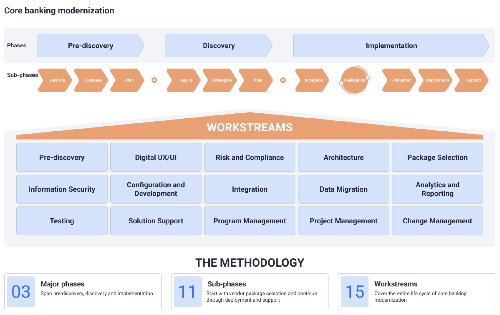
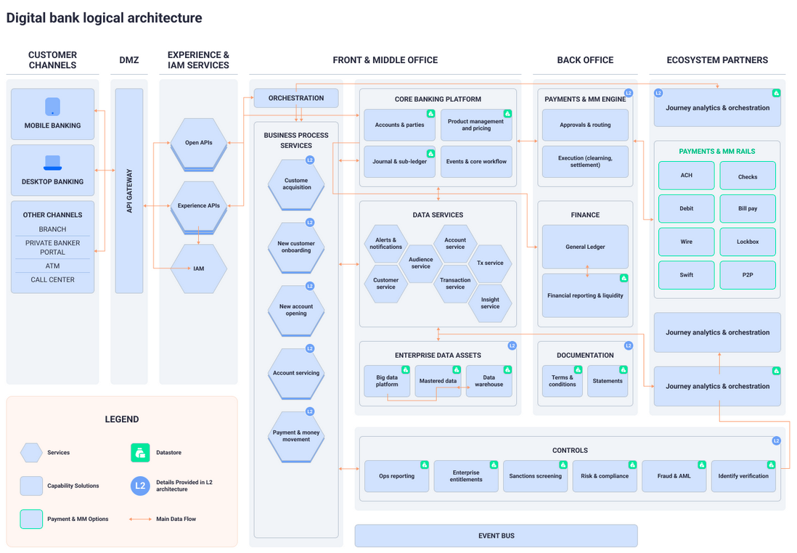
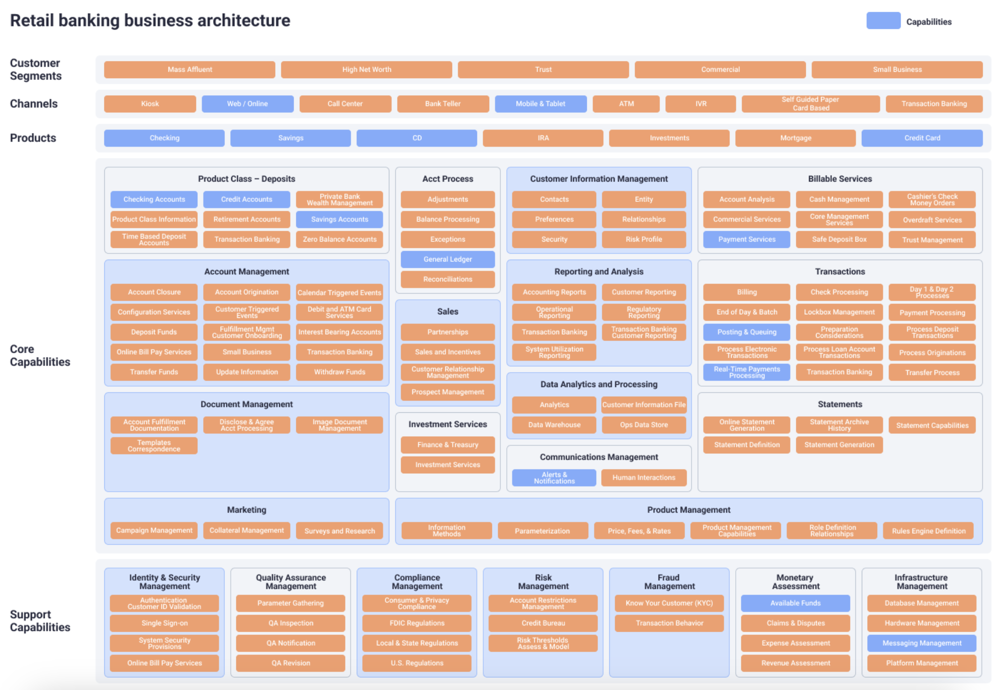
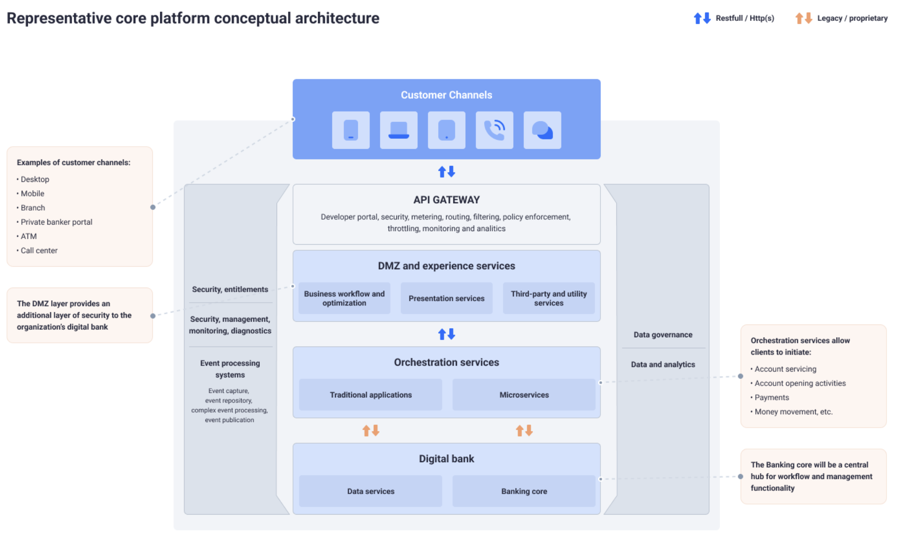
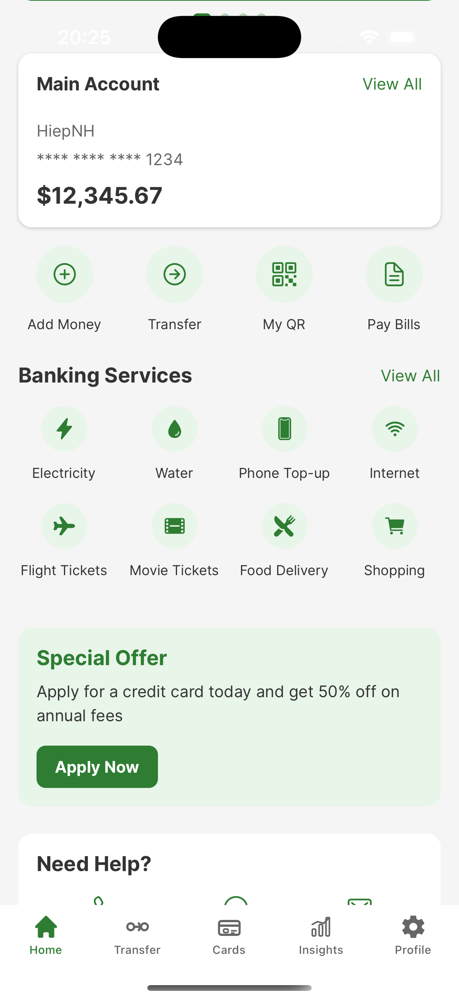
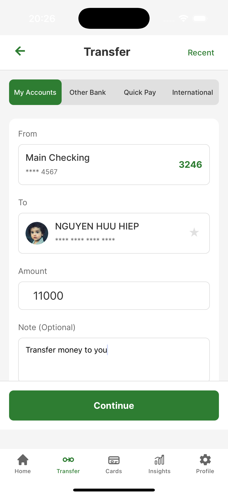
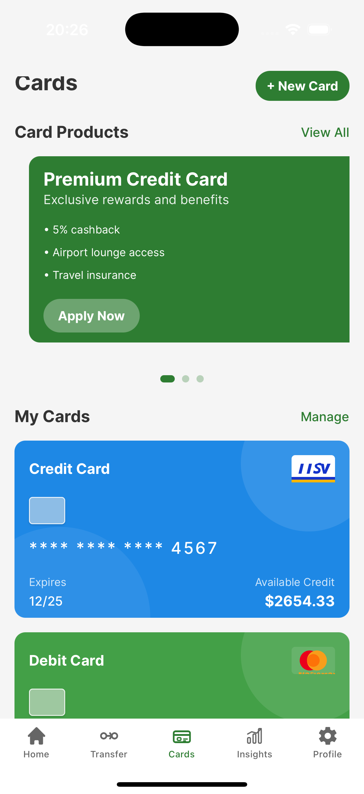
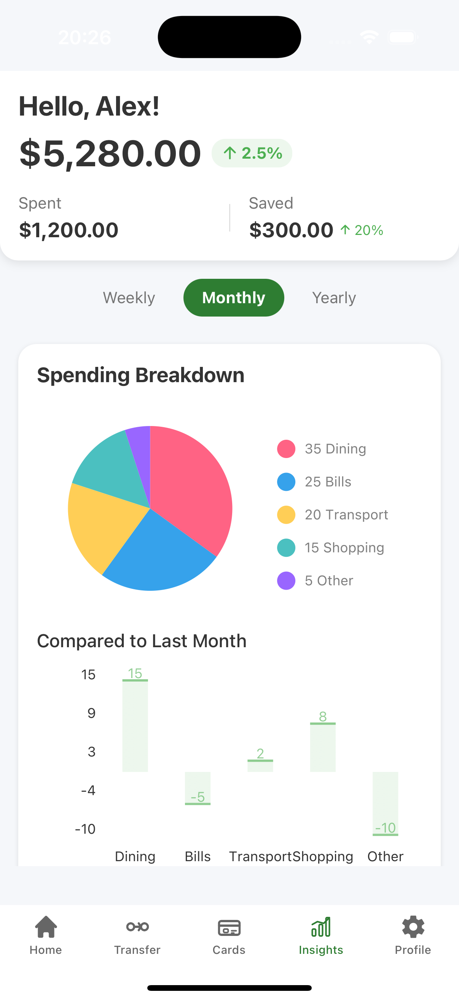
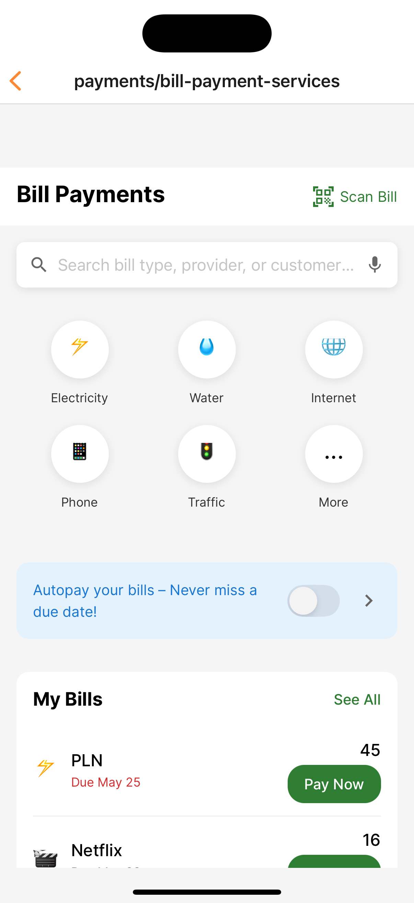

# Digital Bank Hub: All in one digital banking solution

Digital Bank Hub is a modular, enterprise-grade platform for building modern digital banking solutions. It provides a comprehensive set of business, technical, and channel components to accelerate the development of scalable, secure, and compliant financial services.

---

## Project Structure

The repository is organized into several key domains:


### Components

- **architecture/**  
  Contains high-level system architecture, design documents, and reference diagrams.

<!-- Galaxy panel style for images -->
<div align="center" style="display: flex; flex-wrap: wrap; gap: 16px; justify-content: center;">

  
  
  
  

</div>


- **business_system/**  
  Houses the business logic and domain-driven modules:
  - `core/`: Account management, transactions, customer info, product management, etc.
  - `support/`: Auxiliary services such as fraud management, KYC, analytics, and more.

- **channels/**  
  Implements various customer interaction channels:
  - `mobile/`: Mobile banking app source code.

<!-- Galaxy panel style for images -->
<div align="center" style="display: flex; flex-wrap: wrap; gap: 16px; justify-content: center;">

  
  
  
  
  

</div>

  - `web_online/`, `private_portal/`: Web-based banking portals.
  - `atm/`, `bank_teller/`, `call_center/`, `kiosk/`: Other banking channels.

- **core_banking/**  
  The heart of the platform, including:
  - `midaz/`: The open-source ledger and transaction engine (see [core_banking/midaz/README.md](core_banking/midaz/README.md) for details).
  - `midaz-console/`: Management and monitoring tools for the core banking engine.

- **technical_system/**  
  Infrastructure management, deployment scripts, and technical utilities.

  - Infastructure
    - Nginx, Nginx UI

---

## Getting Started

1. **Clone the repository**
   ```sh
   git clone https://github.com/changtraisitinh/digital-bank-hub.git
   cd digital-bank-hub
2. **Explore the core banking engine**

- See core_banking/midaz/README.md for setup and usage instructions.

3. **Run a channel app**

- For example, to run the mobile app, see channels/mobile/BankApp/README.md.

4. **Review business modules**

- Explore business logic in business_system/core/ and supporting services in business_system/support/.


# About 
Developed by HiepNH