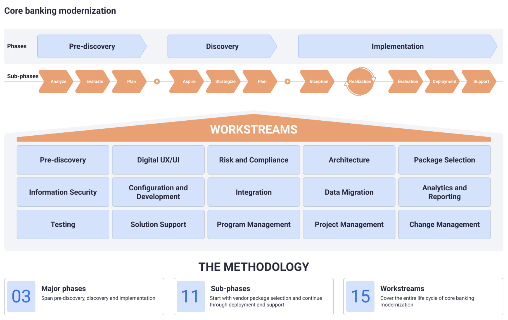
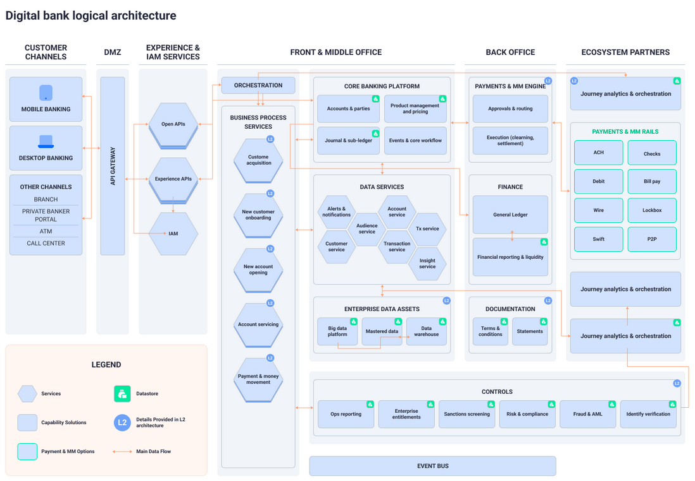
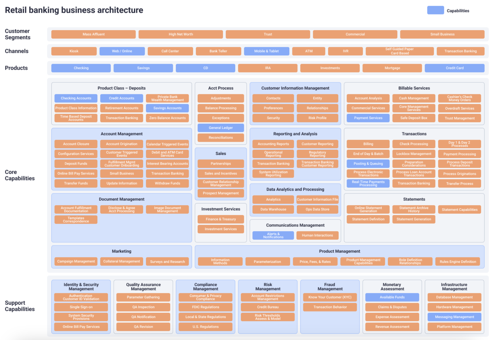
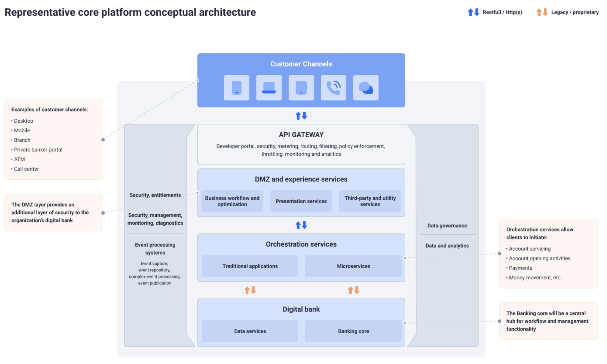
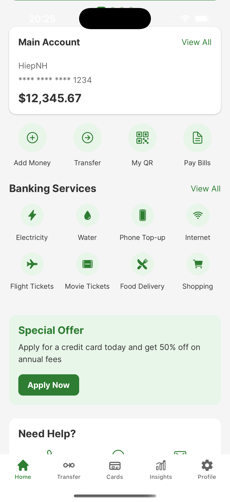
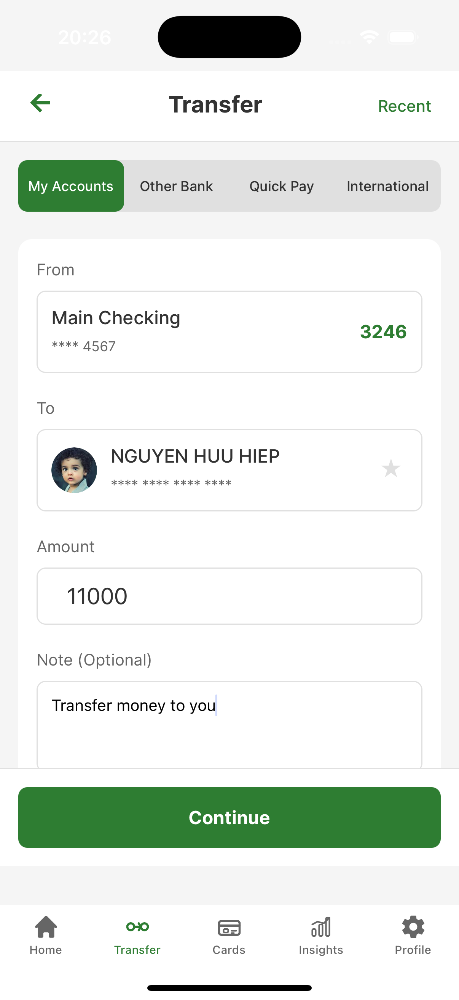
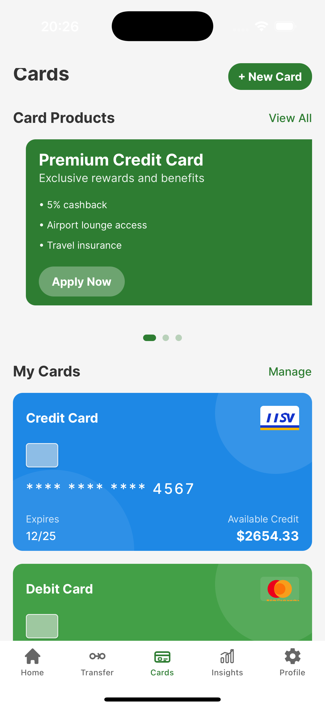
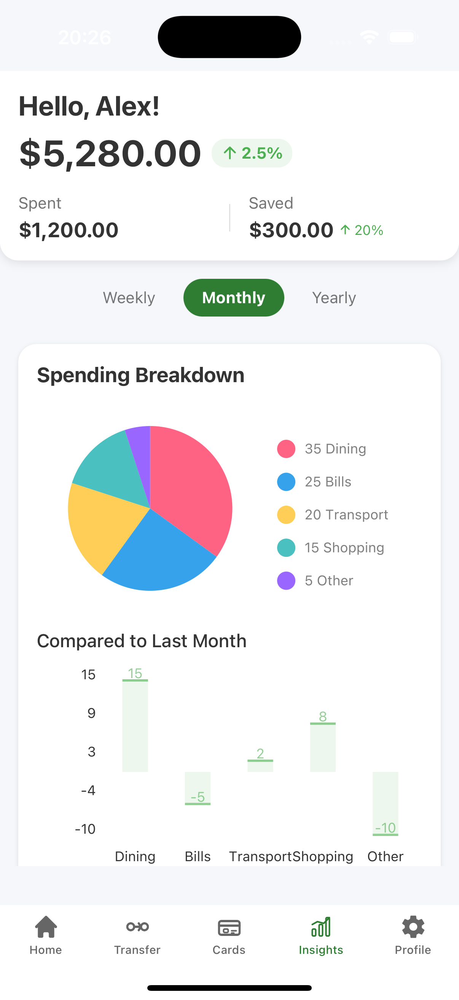
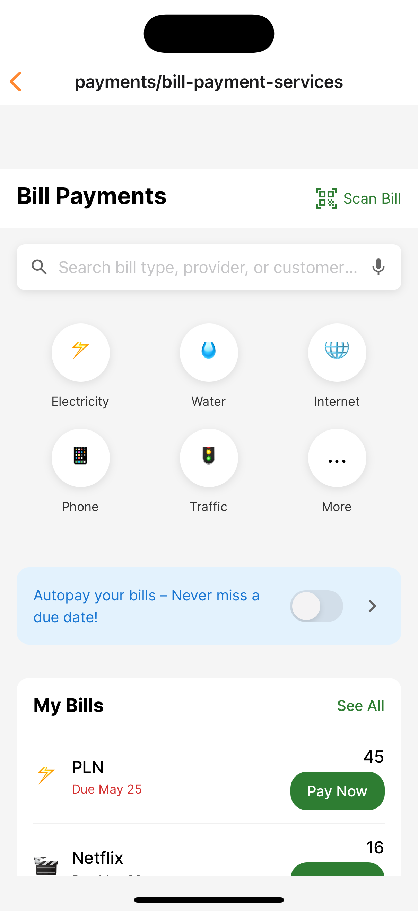

# Digital Bank Hub: All in one digital banking solution

Digital Bank Hub is a modular, enterprise-grade platform for building modern digital banking solutions. It provides a comprehensive set of business, technical, and channel components to accelerate the development of scalable, secure, and compliant financial services.

---

## Project Structure

The repository is organized by engineering ownership and deployable units.

### Components

- **docs/**  
  Architecture, deployment, and development documentation.

<!-- Galaxy panel style for images -->
<div align="center" style="display: flex; flex-wrap: wrap; gap: 16px; justify-content: center;">

  
  
  
  

</div>


- **apps/**  
  Customer-facing applications.
  - `mobile/bank-app/`: Expo/React Native mobile banking app.

<!-- Galaxy panel style for images -->
<div align="center" style="display: flex; flex-wrap: wrap; gap: 16px; justify-content: center;">

  
  
  
  
  

</div>

- **services/**  
  First-party backend services grouped by domain.
  - `core-banking/`
  - `security/`
  - `communications/`

- **platforms/**  
  Embedded or externally maintained platform code kept intact.
  - [Midaz](https://github.com/LerianStudio/midaz): open-source ledger and transaction engine.
  - Ballerine: KYC/KYB workflow and risk platform.

- **infrastructure/**  
  Deployment, gateway, Docker, Kubernetes, monitoring, and Terraform assets.

- **shared/**  
  Shared contracts, configs, libraries, and utilities.

- **tests/**  
  Cross-system test suites.

- **scripts/**  
  Repository-level setup and maintenance automation.

---

## Getting Started

1. **Clone the repository**
   ```sh
   git clone https://github.com/changtraisitinh/digital-bank-hub.git
   cd digital-bank-hub
2. **Explore the core banking engine**

- See `platforms/midaz/README.md` for setup and usage instructions.

3. **Run a channel app**

- For example, to run the mobile app, see `apps/mobile/bank-app/README.md`.

4. **Review first-party services**

- Explore first-party service code in `services/` and platform integrations in `platforms/`.


# About 
Developed by HiepNH
